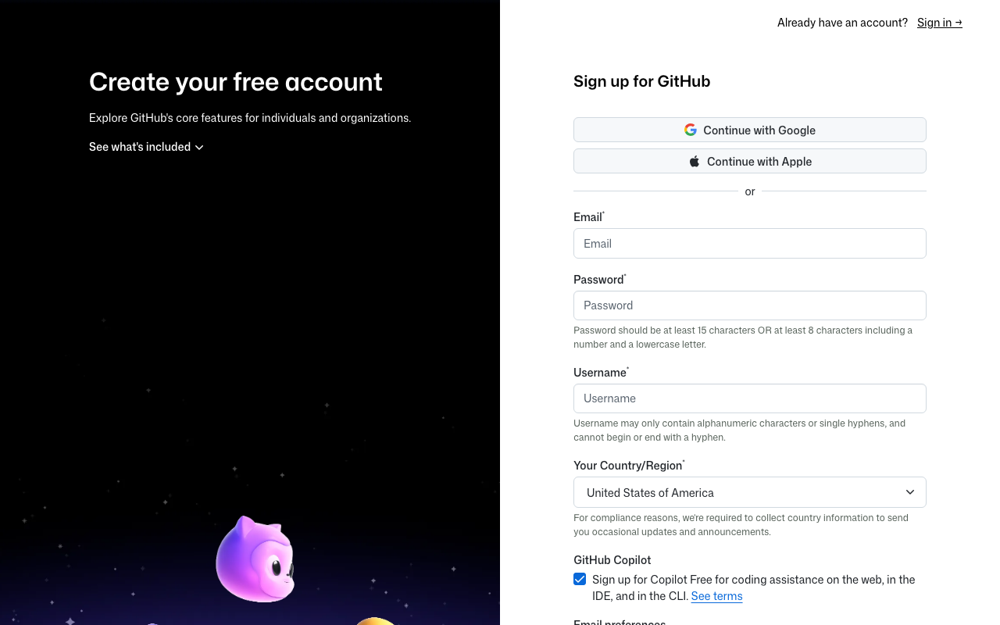
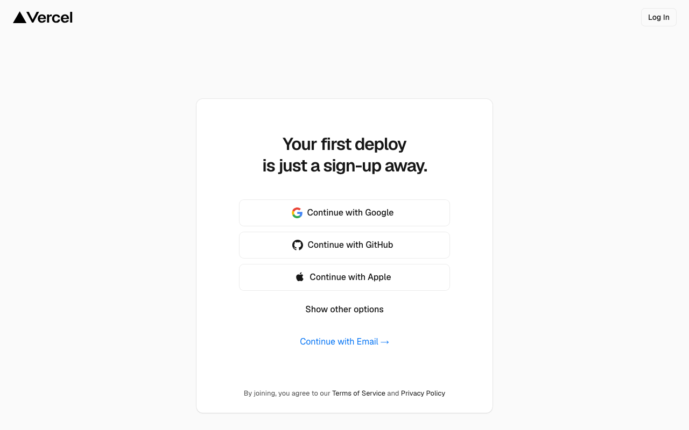
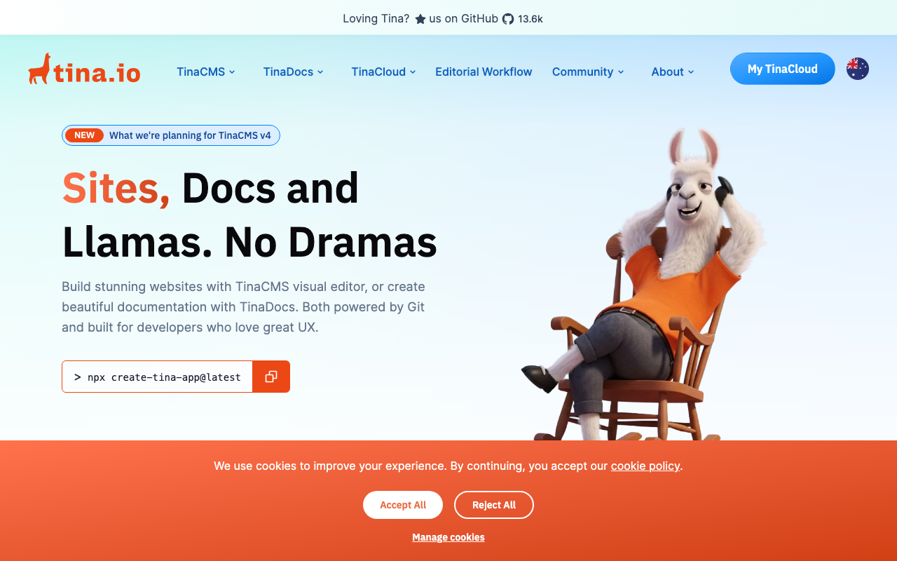
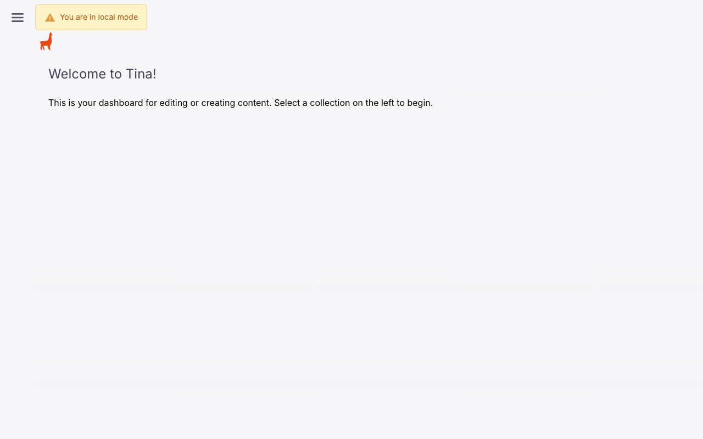
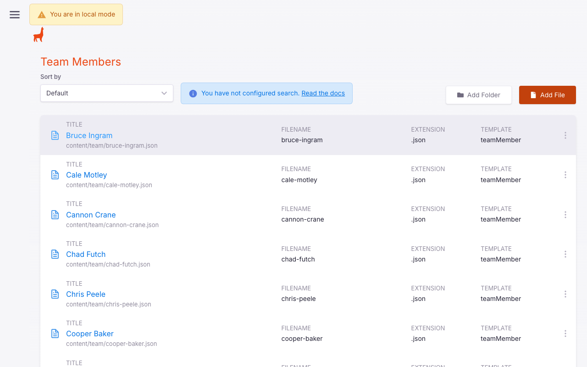
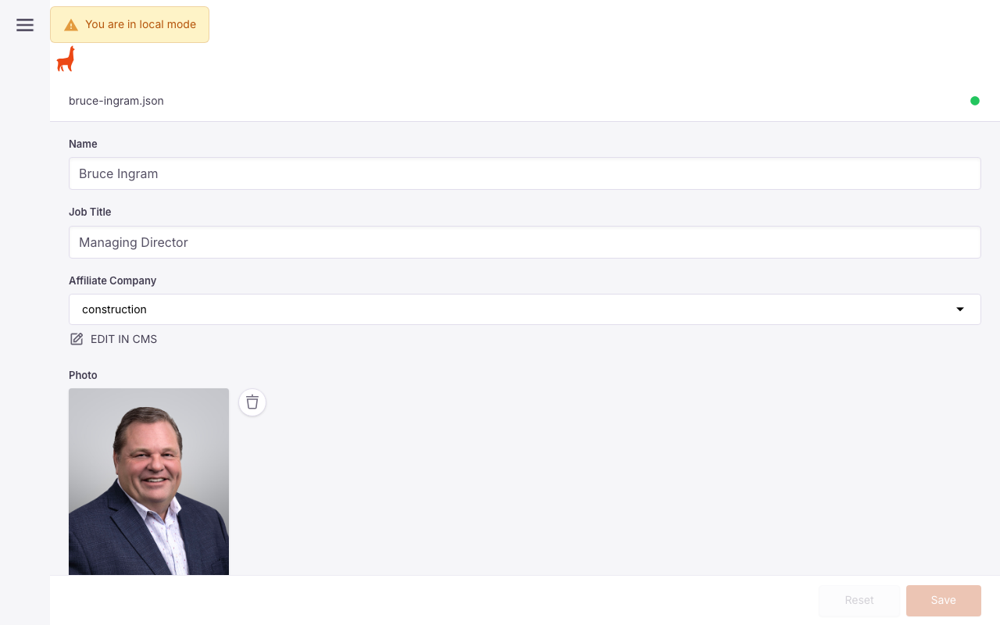

# Birdsey Group Website: Client Handoff Guide
**Prepared for:** Lisa McGuire
**Prepared by:** Visual Boston
**Date:** June 2026

---

## Overview

This guide covers everything you need to take ownership of the Birdsey Group website. By the end you will have three accounts set up, understand how to update content, know how to monitor contact form submissions, and be ready for the site to go live before the mid-July deadline.

**The sequence matters. Create accounts in this order:**
1. GitHub → 2. Vercel → 3. TinaCMS

---

## Step 1: GitHub Account

GitHub stores the website's code. You need an account so we can transfer the project to you.

1. Go to **github.com** and click **Sign up**
2. Use a business email address (e.g. your Birdsey Group email)
3. Choose the **Free** plan (it covers everything you need)
4. Verify your email address when prompted
5. **Share your GitHub username and the email you signed up with back to Mark**

That's all you need to do. We'll handle adding you to the repository.

---

## Step 2: Vercel Account

Vercel hosts the website. It publishes automatically every time the code is updated.

1. Go to **vercel.com** and click **Sign Up**
2. Choose **Continue with GitHub** to link the two accounts together (no separate password needed)
3. When asked about a plan, choose **Pro** ($20/month); Birdsey Group is a commercial business and the free Hobby plan is for personal projects only
4. **Share your Vercel account email (same as GitHub) back to Mark**

Once you've shared your credentials, we'll import the project into your Vercel account and connect your domain.

---

## Step 3: TinaCMS Account

TinaCMS is the content editor for the website. This is what you'll use day-to-day to update bios, add news articles, edit contact info, etc.

1. Go to **tina.io** and click **Get Started**
2. Choose **Continue with GitHub** (same account you just created)
3. You'll land on a dashboard; you don't need to create a project yet
4. **Share your TinaCMS account email back to Mark**

After you share it, we'll connect your TinaCMS account to the project and send you the final credentials.

---

## What to Send Back to Mark

Once all three accounts are created, send Mark the following:

| What | Where to find it |
|------|-----------------|
| GitHub username | github.com → top-right profile icon |
| GitHub signup email | The email you used for GitHub |
| Vercel signup email | Same as GitHub (if you used "Continue with GitHub") |
| TinaCMS signup email | Same as GitHub |

---

## Step 4: Updating Website Content (TinaCMS)

Once your accounts are connected, you'll edit the website by going to **birdseygroup.com/admin** and logging in with your GitHub account. You'll land on a dashboard like this:

### Updating Team Bios

This is the most common task. Here's how to update a bio:

1. Go to **birdseygroup.com/admin**
2. In the left sidebar, click **Team Members**
3. Find the person you want to update and click their name

4. Edit any of the following fields:
   - **Name**: display name
   - **Title**: job title
   - **Bio**: the written biography (plain text, paragraph breaks are supported)
   - **Photo**: upload a new headshot (JPG or PNG, ideally square or portrait orientation)
   - **LinkedIn URL**: full URL to their LinkedIn profile
   - **Affiliate**: which company they belong to (Corporate, Commercial, Construction, Residential, or Board of Advisors)
5. Click **Save** when done

Changes go live within 1–2 minutes after saving.

> **Tip for loading the bios:** Start with Sandford's bio as a practice run. It's already populated so you can see the format. Make a small change, save it, and visit the live site to confirm it updated before doing the rest.

### Adding a News / Insights Article

1. In the left sidebar, click **Insights Articles**
2. Click **Add File** (top right)
3. Fill in:
   - **Title**: the article headline
   - **Body**: the full article text (supports basic formatting)
   - **Date**: publication date
4. Click **Save**

The article will appear in the News section on the homepage and get its own page at birdseygroup.com/insights/[article-slug].

### Editing Contact Info or Footer

1. In the left sidebar, click **Global Settings**
2. Expand **Footer** to edit phone number, email address, or office address
3. Click **Save**

---

## Step 5: Contact Form (Forminit)

The contact form on the website uses **Forminit** to receive and store submissions. No email setup is required on your end; submissions are stored in the Forminit dashboard.

### Viewing Form Submissions

1. Go to **forminit.com** and log in (we'll share the account credentials separately)
2. Click on the **Birdsey Group** form
3. All submissions are listed with timestamp, name, email, phone number, and message
4. You can export submissions to CSV if needed

### What a Submission Looks Like

Each contact form entry captures:
- First and last name
- Email address
- Phone number
- Message / inquiry

Forminit does not send you email notifications by default, but you can enable them in the dashboard under **Notifications > Email**.

---

## Domain Connection

Once you've set up your Vercel account and shared it with us, the final step is pointing your domain to Vercel. This is a DNS change we'll walk you through; it takes about 10 minutes and the site will be fully live within a few hours of that change.

If the domain is currently managed through GoDaddy, Namecheap, or a similar registrar, have your login credentials for that account handy before we do the go-live call.

---

## Training Session

We recommend a 30–45 minute screen-share walkthrough before go-live. During that session we can:

- Walk through editing bios together (good first exercise)
- Show you how to add a news article
- Cover the Forminit dashboard
- Answer any questions about the site

Alec mentioned this week, so let us know what times work and we'll schedule it.

---

## Frequently Asked Questions

**Do I need to know how to code?**
No. TinaCMS is a visual editor; you edit fields like a form, not code.

**What happens if I make a mistake?**
TinaCMS keeps a version history. If something looks wrong after saving, let us know and we can restore a previous version.

**Can multiple people edit the site?**
Yes. We can add additional users to TinaCMS. Just share their names and emails with us.

**Who do I contact if something breaks?**
Reach out to Mark at **mark@visualboston.com** or Alec directly. We'll be available for questions for [30 days / duration TBD] after launch.

**What about Privacy Policy, Terms of Service, and Cookie notices?**
These pages will be included before launch. Visual Boston will draft and wire them into the site.

**What about website analytics?**
Google Search Console will be set up before launch. Visual Boston will configure it and share access once the domain is live.

---

## Account Setup Checklist

Use this to track your progress:

- [ ] GitHub account created
- [ ] GitHub username and email sent to Mark
- [ ] Vercel account created (via GitHub)
- [ ] Vercel email sent to Mark
- [ ] TinaCMS account created (via GitHub)
- [ ] TinaCMS email sent to Mark
- [ ] Training session scheduled
- [ ] Domain registrar login located (for go-live day)

---

*Questions? Contact Mark Stenquist at mark@visualboston.com*
